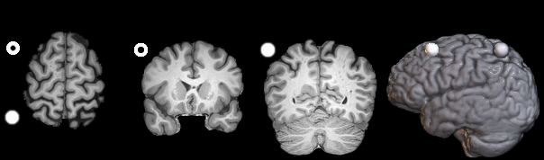
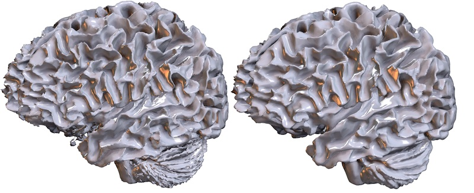
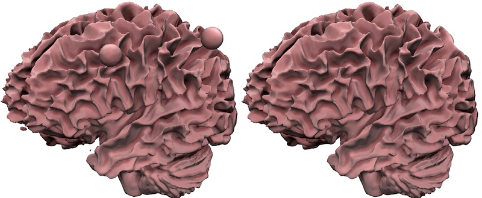
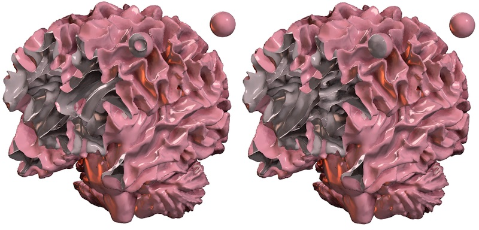
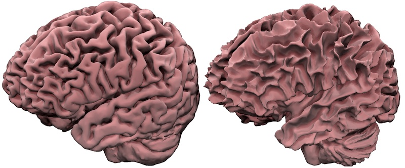
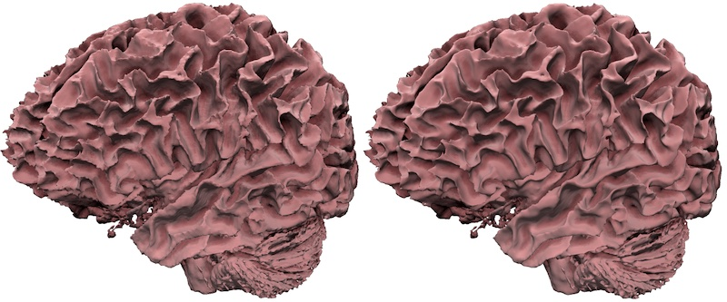
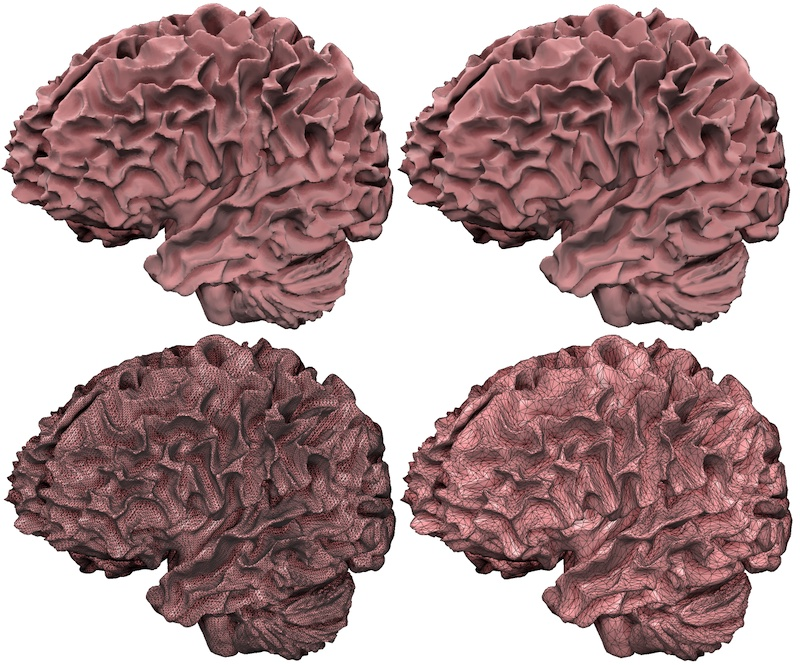

## About

This tool converts a NIfTI 3D voxel image to triangulated mesh. It can save meshes in in the GIfTI (.gii), mz3, ply, FreeSurfer (.pial), stl, vtk, formats. You can use [dcm2niix](https://github.com/rordenlab/dcm2niix) to convert DICOM images to NIfTI.

## Compiling

For Unix computers (Linux, macOS), you can build the executable using the make command:

```
git clone https://github.com/neurolabusc/nii2mesh
cd nii2mesh/src
make
```

You can also compile the program using Windows, but you may find it easier to download the pre-compiled executable found by selecting the [`Releases`](https://github.com/neurolabusc/nii2mesh/releases/latest/).

## Usage

This application converts 

```
Converts a NIfTI voxelwise image to triangulated mesh.
Usage: ./nii2mesh [options] niftiname meshname
Options
    -b v    bubble fill (0=bubbles included, 1=bubbles filled, default 0)
    -i v    isosurface intensity (default mid-range)
    -l v    only keep largest cluster (0=all, 1=largest, default 1)
    -p v    pre-smoothing (0=skip, 1=smooth, default 1)
    -r v    reduction factor (default 0.25)
    -s v    post-smoothing iterations (default 0)
    -v v    verbose (0=silent, 1=verbose, default 0)
mesh extension sets format (.gii, .mz3, .obj, .ply, .pial, .stl, .vtk)
Example: './nii2mesh myInput.nii myOutput.obj'
Example: './nii2mesh -i 22 myInput.nii myOutput.obj'
Example: './nii2mesh -p 0 img.nii out.ply'
Example: './nii2mesh -v 1 img.nii out.ply'
Example: './nii2mesh -r 0.1 img.nii small.gii'
```
## Processing Steps

The program provides several options to allow you to fine tune conversion. To illustrate these options, we will show how they influence the included image bet.nii.gz. You can use [MRIcroGL](https://www.nitrc.org/plugins/mwiki/index.php/mricrogl:MainPage) to view this voxel-based data. The raw data looks like this:



Specifically, it is a T1 image that has been brain extracted (we have removed the scalp). Note that there is a hollow ball near the left frontal cortex and a solid ball near the right posterior lobe.

In the images below, we will view the resulting meshes using [Surfice](https://www.nitrc.org/plugins/mwiki/index.php/surfice:MainPage). Another good tool for viewing meshes is [MeshLab](https://www.meshlab.net).

1. You can choose to pre-smooth your data (`-p 1`) or not (`-p 0`) prior to making a mesh. This tends emulates a Gaussian blur, which tends to attenuate noise in the image. 

```
./nii2mesh -p 0 bet.nii.gz p0.gii
./nii2mesh -p 1 bet.nii.gz p1.gii
```



3. You can choose to only retain the largest connected object (`-1 1`) or keep all objects (`-l 0`). The image below shows that the balls and other small blobs do not appear when `-l 1` is selected.

```
./nii2mesh -l 0 bet.nii.gz l0.gii
./nii2mesh -l 1 bet.nii.gz l1.gii
```



3. You can choose to fill bubbles (`-b 1`) or retain bubbles (`-b 0`). Filling holes will create solid objects if you print them. If you look at the cut-away views below you will notice that this option determines whether the ventricles inside the brain and the interior sphere exist in the mesh file.

```
./nii2mesh -l 0 -b 1 bet.nii.gz b1.gii
./nii2mesh -l 0 -b 0 bet.nii.gz b0.gii
```



4. You can choose an isosurface value. This is the voxel brightness used to distinguish air from tissue. If you click on the voxel data with MRIcroGL, you will note that the brightness of the selected voxel location is shown in the title bar, allowing you to estimate a good boundary. The image below shows the difference between `-i 88` and `-i 128` for our example image. If you do not specify a value, the program will default to the middle intensity between the brightest and darkest value.

```
./nii2mesh -i 88 bet.nii.gz i88.gii
./nii2mesh -i 128 bet.nii.gz i128.gii
```



5. The `-s` option allows you to specify the number of iterations for the [smoothing of your mesh](https://doi.org/10.1111/1467-8659.00334). Unlike the `p`re-smooth, the `s`mooth is applied after the voxels are converted into a triangular mesh. This effect is much more subtle than the pre-smooth. This option is best suited for low resolution, block images. It is worth noting that the reduction factor also will tend to smooth images, attenuating small variations. Therefore, to illustrate the effect we are turning off both the pre-smoothing and the mesh reduction.

```
./nii2mesh -r 1 -p 0 -s 100 bet.nii.gz s100.gii
./nii2mesh -r 1 -p 0 -s 0 bet.nii.gz s0.gii
```



6. The reduction factor allows you simplify the mesh, resulting in a much smaller file size and faster renderng on slow hardware. This stage uses [Sven Forstmann's](https://github.com/sp4cerat/Fast-Quadric-Mesh-Simplification) implementation which is [adaptive](http://www.alecjacobson.com/weblog/?p=4444), using smaller triangles in regions of curvature and large triangles in regions flat regions. Choosing a value of `-r 0.15` will eliminate 85% of the triangles. Notice how similar the top row appears, while the bottom row illustrates a dramatic reduction in complexity.

```
./nii2mesh -r 1 bet.nii.gz r100.gii
./nii2mesh -r 0.15 bet.nii.gz r15.gii 
```



## Printing

You can use this tool to generate

1. If your MRI is in DICOM format, convert it to NIfTI with [dcm2niix](https://github.com/rordenlab/dcm2niix).
2. Brain extract your image. You could use [BET](https://fsl.fmrib.ox.ac.uk/fsl/fslwiki/BET/UserGuide), [FAST](https://fsl.fmrib.ox.ac.uk/fsl/fslwiki/FAST) or [HD-BET](https://github.com/MIC-DKFZ/HD-BET) for this step.
3. Apply nii2mesh to generate a mesh you can print locally or using a service like [Shapeways](https://www.shapeways.com) or [Kraftwurx](http://www.kraftwurx.com)

nii2mesh is a general mesh making method, which can turn be applied to any NIfTI image: a MRI or CT scan of any region of the body, a high-quality scan of any object including the animals of [DigiMorph](http://digimorph.org/index.phtml), [phenome10k](https://www.phenome10k.org), [MorphoSource](https://www.morphosource.org) or [other 3D databases](https://morphomuseum.com/links).

For brain specific printing, you may want to look at these tutorials.

 - [nii_nii2stl](https://github.com/rordenlab/spmScripts/blob/master/nii_nii2stl.m) uses Matlab and SPM.
 - [Fei Gu](https://flashsherlock.github.io/2021/10/23/how-to-print-your-brain/) uses FreeSrufer, MeshLab and Meshmixer.
 - [Michael Notter](https://github.com/miykael/3dprintyourbrain) uses FreeSurfer and MeshLab.
 - This [Instructables](https://www.instructables.com/3D-print-your-own-brain/) tutorial uses FreeSurfer and MeshLab.
 - [Mohan Gupta](https://www.mohanwugupta.com/post/3d_brain_printing/) uses FreeSurfer and MeshLab.
 - [Ford Burles](https://fordburles.com/3d-print-brain-guide.html) uses FreeSurfer and MeshLab or Blender.

## Links

 - Seminal marching cubes page by [Paul Bourke](http://paulbourke.net/geometry/polygonise/).
 - [Sven Forstmann fast mesh simplification](https://github.com/sp4cerat/Fast-Quadric-Mesh-Simplification) using [quadric error metrics](http://www.cs.cmu.edu/~./garland/Papers/quadric2.pdf).
 - [Laplacian smooth with Humphrey’s Classes to preserve volume](https://doi.org/10.1111/1467-8659.00334), also as [PDF](http://informatikbuero.com/downloads/Improved_Laplacian_Smoothing_of_Noisy_Surface_Meshes.pdf).
 - AFNI [IsoSurface](https://afni.nimh.nih.gov/pub/dist/doc/program_help/IsoSurface.html) using an [efficient marching cubes implementation](https://www.researchgate.net/publication/228537283_Efficient_Implementation_of_Marching_Cubes%27_Cases_with_Topological_Guarantees).
 - [Alec Jacobson has a nice demonstration of adaptive mesh simplification versus decimation](http://www.alecjacobson.com/weblog/?p=4444).
 - [Alec Jacobson](https://github.com/alecjacobson/geometry-processing-smoothing) describes smoothing and provides example noisy meshes.
 - MRtrix3 includes [voxel2mesh](https://mrtrix.readthedocs.io/en/latest/reference/commands/voxel2mesh.html)
 - FSL [FIRST](https://fsl.fmrib.ox.ac.uk/fsl/fslwiki/FIRST/UserGuide) automates tissue segmentation.